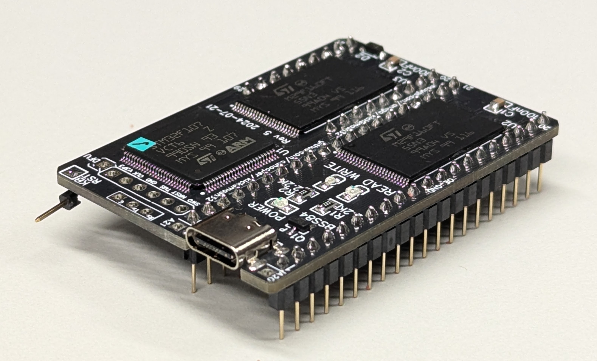
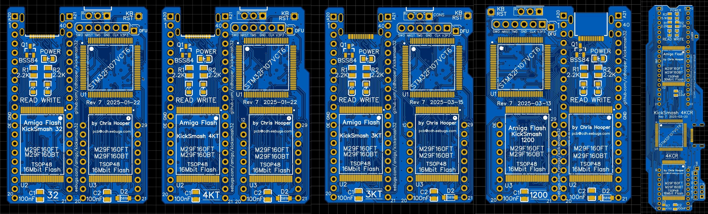

# KickSmash32

KickSmash32 is a Kickstart ROM replacement module for the Amiga 3000 and Amiga 4000 computer systems. There are other versions here for the Amiga 1200, 3000T, 4000T, and 4000CR. There is not yet a version for 16-bit Amigas such as the Amiga 500, 600, and 2000.

Features include:

* In-system programming via an Amiga command line utility (smash)
* Out-of-system programming (USB-C) via a Linux command line utility (hostsmash)
* Up to 8 independent flash banks
* Configurable ROM bank switching on long reboot or cold power-on
* Optional host file service to the Amiga over the USB-C link (smashfs and smashftp)

All hardware, firmware, and software is open source.

View files in the doc directory for complete documentation.

-------------------------------------------------------

## [Amiga CLI](doc/AMIGACLI.md)

The smash utility is used to interact with Kicksmash, including writing
Kickstart ROM images and switching to them. The smashftp program can be
used to transfer files with your host PC. The smashfs program will
automatically mount volumes exported from your host PC.

See [doc/AMIGACLI.md](doc/AMIGACLI.md) for usage examples.

-------------------------------------------------------

## [ROM Switcher](doc/SWITCHER.md)
The ROM switcher is either a stand-alone ROM image or a Kickstart module
which, when linked with your favorite (3.1.4+ recommended) Kickstart image,
will provide a list of ROM images and allow you to pick which one to use.
It's recommended that you include the ROM switcher in your LongReset list.
 

See [doc/SWITCHER.md](doc/SWITCHER.md) for examples.

-------------------------------------------------------

## [Development Environment](doc/DEVENV.md)

Instructions for building Kicksmash firmware, Amiga utilities,
and host programs are
[available in doc/DEVENV.md](doc/DEVENV.md).

-------------------------------------------------------

## [Which Kicksmash do I need?](doc/WHICH.md)

Commodore produced a variety of Amiga machines over the years.
Unlike the Zorro slot, one thing that they did not standardize is the
location, orientation, and spacing of the ROM socket(s) in the machine.
Very few of the Amiga models have a compatible layout. In fact the only
two are the Amiga 3000 and the original Amiga 4000.

[See doc/WHICH.md](doc/WHICH.md) for a guide on which KickSmash you
should choose based on your Amiga model.

-------------------------------------------------------

## [Yes, there is FAQ](doc/FAQ.txt)

But it may not have the answers you seek. Check the doc directory
for additional information (any txt file). Here are some:

* [Hardware Build](doc/hw_build.txt)
* [Hardware Programming](doc/hw_programming.txt)
* [Hardware Installation](doc/hw_install.txt)
* [Software Build](doc/sw_build.txt)
* [Software installation](doc/sw_install.txt)
* [Hostsmash Utility, for your host PC](doc/sw_hostsmash.txt)
* [Kicksmash Firmware](doc/sw_kicksmash.txt)
* [AmigaOS Smash Utility](doc/sw_smash.txt)
* [AmigaOS SmashFS](doc/sw_smashfs.txt)
* [AmigaOS SmashFS for Kickstart ROM](doc/sw_smashfsrom.txt)
* [AmigaOS SmashFTP](doc/sw_smashftp.txt)
* [USB Cable options](doc/usb_cables.txt)
* [Windows Notes](doc/windows_notes.txt)
