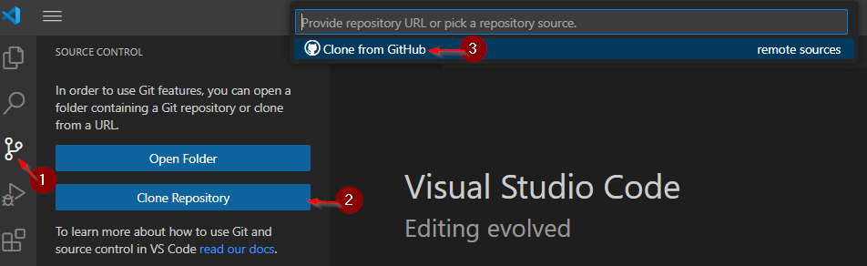
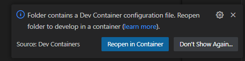

# KickSmash32

KickSmash32 is a Kickstart ROM replacement module for the Amiga 3000 and Amiga 4000 computer systems. 

Features include:

* In-system programming via an Amiga command line utility (smash)
* Out-of-system programming (USB-C) via a Linux command line utility (hostsmash)
* Up to 8 independent flash banks
* Configurable ROM bank switching on long reboot or cold power-on
* Optional host file service to the Amiga over the USB-C link (smashfs and smashftp)

All hardware, firmware, and software is open source.

View files in the doc directory for complete documentation.

-------------------------------------------------------

## Usage Example

If you are familiar with the Amiga CLI and have the ability to get
ROM images to your Amiga, then programming and switching between Kickstart
ROM banks in the running system is not difficult.

List all banks.

Write DiagROM to a bank.

Name that bank for future reference.

It's always a good idea to verify what you wrote.

Switch to that bank and reboot.

After pressing Enter, your computer is now running DiagROM.

How do you switch back? If you had specified a "long reset" sequence, you could press and hold Control-Amiga-Amiga to switch back. Since you haven't yet done that, you will need to power cycle your Amiga or connect to the KickSmash over USB and tell it from the host to switch.

-------------------------------------------------------

## ROM Switcher

The ROM switcher is a Kickstart module which, when linked with your
favorite (3.1.4+ recommended) Kickstart image, will provide a list of
ROM images and allow you to pick which one to use. It's recommended
that you include the ROM switcher in your LongReset list.

-------------------------------------------------------

## Dev Environment

The easiest way to build the software is to use VSCode with the pre-configured devcontainer. You will however need a working Docker daemon and Git installation in order to clone the repo and run the container image.

> [!NOTE]
> if you are not familiar with VSCode and devcontainers please read [Developing inside a Container](https://code.visualstudio.com/docs/devcontainers/containers)

There are now just two steps to get the devcontainer up and running.

1. Clone the repo using VSCode. 
2. Click `reopen in container` from the notification. 

> [!TIP]
>It may take some time to build/download the container image the first time you click `reopen in container` just be patient.

Once these two steps are complete, you can open a new terminal in VSCode (`ctrl` + `shift` + `'`). This terminal will be attached to the Fedora devcontainer.

To build the software, simply press `ctrl` + `shift` + `b`, or alternatively select `Run Build Task` from the `Termianl` Menu.

This will invoke `Make All` inside the devcontainer and the root directory of the repo.
