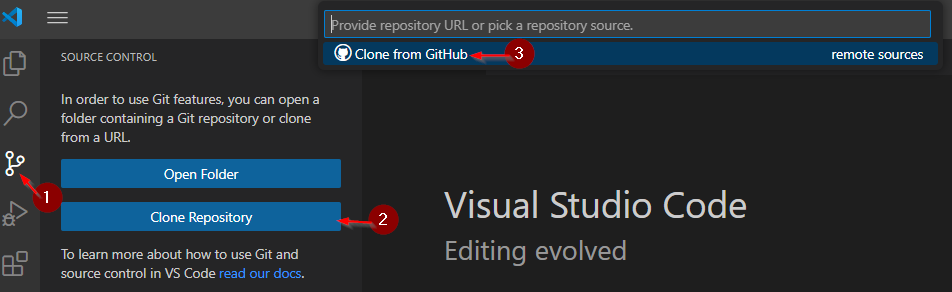
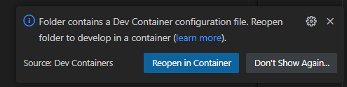

The easiest way to build the software is to use VSCode with the pre-configured devcontainer. You will however need a working Docker daemon and Git installation in order to clone the repo and run the container image.

> [!NOTE]
> if you are not familiar with VSCode and devcontainers please read [Developing inside a Container](https://code.visualstudio.com/docs/devcontainers/containers)

There are now just two steps to get the devcontainer up and running for Windows.

1. Clone the repo using VSCode. 
2. Click `reopen in container` from the notification. 

> [!TIP]
>It may take some time to build/download the container image the first time you click `reopen in container` just be patient.

Once these two steps are complete, you can open a new terminal in VSCode (`ctrl` + `shift` + `'`). This terminal will be attached to the Fedora devcontainer.

To build the software, simply press `ctrl` + `shift` + `b`, or alternatively select `Run Build Task` from the `Termianl` Menu.

This will invoke `Make All` inside the devcontainer and the root directory of the repo.

------------------------------------------------------------------

## Linux
```
Install docker on Fedora:
    sudo dnf -y install docker-cli
Start the docker daemon:
    sudo systemctl start docker
optional:
    sudo systemctl enable docker
Verify that docker is set up correctly:
    sudo docker run hello-world
This might not be needed:
    sudo docker pull ghcr.io/mbtaylor1982/kicksmash32_dev_environment:latest
```
### Other useful commands
```
Run a shell in a non-active container:
    sudo docker run -i -t --entrypoint /bin/bash ghcr.io/mbtaylor1982/kicksmash32_dev_environment:latest
Show active docker containers
    sudo docker ps
Start shell in running docker
    sudo docker exec -it brave_shannon bash
Shut down docker container:
    sudo docker stop brave_shannon
```
Clone and build kicksmash:
```
    git clone https://github.com/cdhooper/kicksmash32
    cd kicksmash32
    make -j8
```

The Amiga build devcontainer, created by Mike Taylor, is stored here:
<BR>
    [https://github.com/mbtaylor1982/kicksmash32_dev_environment/pkgs/container/kicksmash32_dev_environment](https://github.com/mbtaylor1982/kicksmash32_dev_environment/pkgs/container/kicksmash32_dev_environment)
