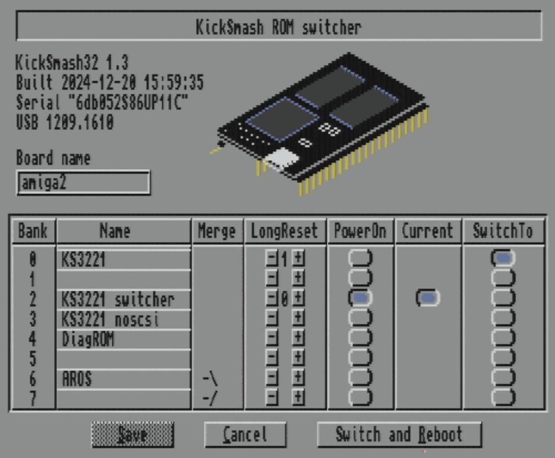
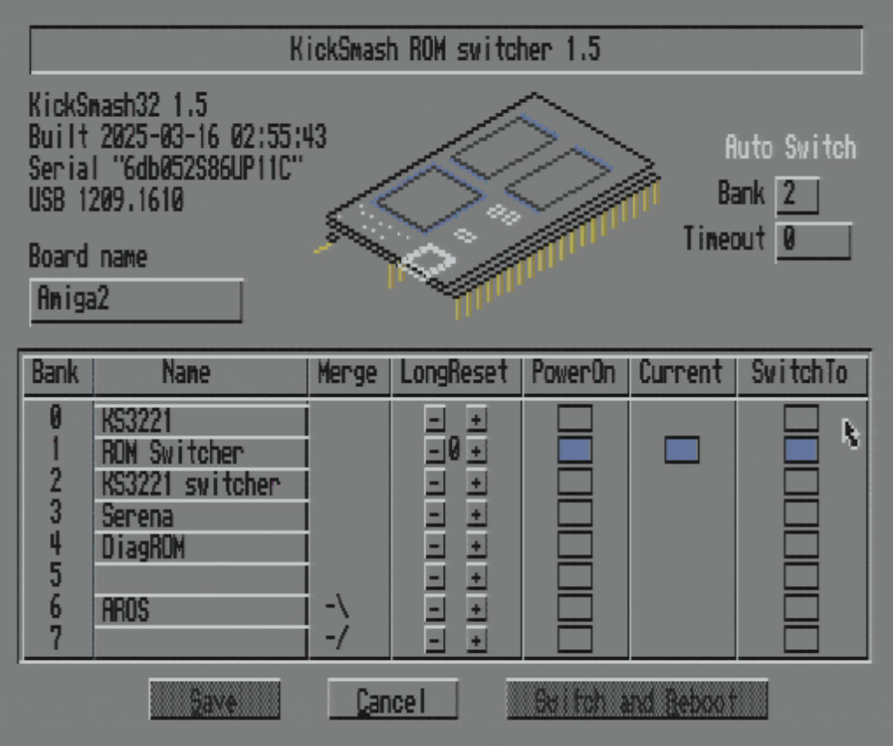

The ROM switcher is a ROM image that you place in one of your banks.
You set it up to start on PowerOn, or start on an Amiga LongReset.
It then offers a graphical menu to select the Kickstart image that
the Amiga should use. It also allows you to change some options, such
as names of the various ROM banks and which ROM to run at PowerOn.

-------------------------------------------------------

The older (1.3 version) of the ROM switcher requires an Amiga Kickstart
ROM. It is then linked into that ROM by a program such as Capitoline.

This version is still supported, but will be going away once the new
version reaches feature complete.

-------------------------------------------------------

The new version (1.5+) of the Kicksmash ROM switcher is a stand-alone
ROM image, not requiring an Amiga Kickstart or manual merging. You
install it in an empty ROM bank and go. It's recommended that you make
the switcher the PowerOn bank or add it to your LongReset chain.

The ROM switcher also now has an optional feature. You can set a
default bank for the ROM switcher to automatically start if there has
been no interaction with the Amiga mouse or Keyboard within the specifie
number of seconds.

As you can see, things do appear slightly different between the ROM
switchers. Now all drawing code (mostly flood fill) has been implemented
at this point. For now, the original version is also still being built.

With the switcher, you can optionally change text for the Board name
and bank names, or change the LongReset sequence or PowerOn image,
or change Auto Switch settings and then select the Save button. The
changes will be stored by Kicksmash for subsequent boots.
