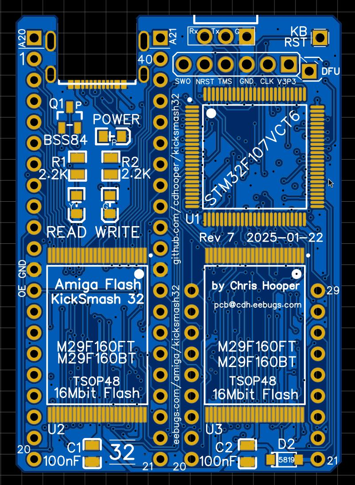

## Which Kicksmash do I need?

As you know, this repository is named "kicksmash32" as it was the first
board version implemented, and the main supported board. At the time, I
didn't know how many variants of motherboards implementing the two ROMs
there were, but I certainly didn't expect this many.

| Amiga model | KickSmash board       | Socket spacing   | Notes |
| :---------- | :-------------------- | :--------------- | :------------------------------------- |
| A1200       | KickSmash 1200        | 17.60 mm (est.)  | D0-D15 ROM is on right, 42-pin sockets. DO NOT USE WITH CPU ACCELERATOR. |
| ReA1200     | KickSmash 1200        | 17.76mm (exact)  | D0-D15 ROM is on right, 42-pin sockets. DO NOT USE WITH CPU ACCELERATOR. |
| A3000       | KickSmash 32          | 19.00 mm (exact) | Older A3000s require ROM Tower adapter https://github.com/cdhooper/amiga_rombankswitcher_a3000_romtower |
| ReA3000     | KickSmash 32          | 19.00 mm (exact) | 42-pin sockets, A20 & A21 not connected to bus |
| A4000       | KickSmash 32          | 19.00 mm (exact) | |
| A3000T      | KickSmash 3KT         | 21.38 mm (est.)  | hostsmash -s 1032 |
| AA3000+     | KickSmash 3KT         | 21.40 mm (exact) | |
| A4000CR     | KickSmash 4KCR        | 55.40 mm (est.)  | D0-D15 ROM is on top, 40-pin sockets |
| ReA4000CR   | KickSmash 4KCR        | 55.40 mm (exact) | D0-D15 ROM is on top, 42-pin sockets |
| A4000T      | KickSmash 4KT         | 20.32 mm (exact) | |
| A4000TX     | KickSmash 32 (maybe?) | 19.69 mm (exact) | Hese says 0.775" |
| AmigaPCI    | Not supported         | 22.85 mm (exact) | D0-D15 ROM is on right, 27C4096 ROM pinout |
| A500        | Not supported         |                  | Single 16-bit socket |
| A600        | Not supported         |                  | Single 16-bit socket |
| A2000       | Not supported         |                  | Single 16-bit socket |
| A1000       | Not supported         |                  | Pair of ROMs form 16-bit data |

## KickSmash PCB images

| Board          | Image  | Install Orientation | KBRST |
| :------------- | :----- | :------------------ | :---- |
| Kicksmash 32   |  | A3000: KS USB connector should face the SDMAC; the A20 and A21 pins should not be popopulated, or should overhang. ReA3000: socket might have 42 pins. The A20 and A21 pins should not be populated if you want to use 1 MB or larger ROMs. A4000: KS USB connector should face Fat Gary / 50 MHz oscillator. A20 and A21 pins should not be populated, or should overhang. A4000TX: KS USB connector should face IDE & floppy connectors. | A3000: RP701 pin 6 or U713 pin 1. A4000: U141 pin 1 |
| Kicksmash 4KCR |  | ROMs are located at the front right of the motherboard. The KS USB connector emerge next to Ramsey. If your board has 40-pin ROM sockets, the A20/A21 KS holes should not be populated, or should overhang. | U141 pin 1. |
| Kicksmash 3KT |  | KS USB connector should emerge next to MB SCSI connector. Note that the Rev7 board requires -s 1032 when programming from hostsmash. | RP701 pin 6 or U713 pin 1 |
| Kicksmash 4KT |  | KS USB connector should overlap Fat Gary | U141 pin 1 |
| Kicksmash 1200 |  | DO NOT USE KICKSMASH1200 WITH A CPU ACCELERATOR. Due to a bug in Gayle, Kicksmash may drive bus data at the same time an accelerator like the TF1260 is reading or writing another device. This can cause the Amiga to crash. There is no current workaround. KS USB connector should face Gayle. If KS A20 and A21 pins are not populated, the KS pins should not be installed in A1200 socket pins 1 and 42. | TP1 pin 9, U13 pin 38, U5 pin 63, or via near E121R silkscreen. |

Refer to the [Hardware Installation documentation](hw_install.txt) for additional installation details.

If you are a builder, refer to [Hardware Build documentation](hw_build.txt) for tips.

The Kicksmash firmware must be programmed, and then at least one ROM image installed.
The [Hardware Programming Guide](hw_programming.txt) mostly covers Kicksmash firmware.
The [Hostsmash Documentation](sw_hostsmash.txt) has additional details.
